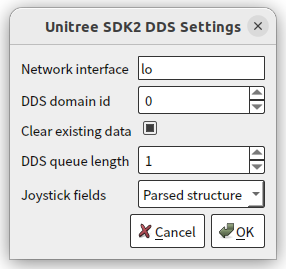
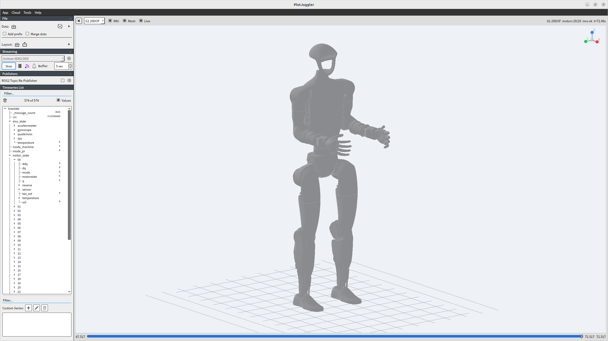

# PlotJuggler Unitree SDK2 Plugin

中文 | [English](README.md)

[PlotJuggler](https://github.com/facontidavide/PlotJuggler) Unitree SDK2 插件。

本仓库提供两个插件：

- `Unitree SDK2 DDS`：DataStreamer 插件，通过 `unitree_sdk2` 订阅 DDS 话题，把强类型消息递归展开为 PlotJuggler 数值曲线。
- `Unitree Robot View`：Toolbox 插件，读取 PlotJuggler 里已有的 `lowstate` IMU 和电机位置曲线，渲染 Unitree 机器人姿态。

## 使用说明

### 1. 下载插件

从 GitHub Releases 下载对应版本的 Linux x86_64 bundle：

```text
plotjuggler-unitree-sdk2-<version>-linux-x86_64.tar.gz
```

解压到任意目录，例如：

```bash
mkdir -p ~/plotjuggler_plugins
tar -xzf plotjuggler-unitree-sdk2-<version>-linux-x86_64.tar.gz \
  -C ~/plotjuggler_plugins
```

解压后的目录就是 PlotJuggler 需要加载的插件目录，例如：

```text
~/plotjuggler_plugins/plotjuggler-unitree-sdk2-<version>-linux-x86_64/
```

### 2. 通过 PlotJuggler UI 添加插件目录

打开 PlotJuggler，进入 `Preferences`，选择 `Plugins` 页签，在 `Plugin folders` 列表中点击 `Add`，选择上面解压得到的目录，然后确认并重启 PlotJuggler。

重启后应能看到：

- Streaming 面板里出现 `Unitree SDK2 DDS`
- `Tools` 菜单里出现 `Unitree Robot View`

也可以用命令行临时加载，不写入 Preferences：

```bash
plotjuggler --plugin_folders "$HOME/plotjuggler_plugins/plotjuggler-unitree-sdk2-<version>-linux-x86_64"
```

### 3. 读取 Unitree DDS 数据

在 PlotJuggler 的 Streaming 面板选择 `Unitree SDK2 DDS`。齿轮按钮用于配置 DDS network interface、domain id、queue length 和 joystick field mode。



点击 `Start` 后插件会扫描 DDS publications，显示话题列表。支持的类型会排在上面并默认勾选；如果机器人或 DDS publisher 后启动，点击 `Refresh` 重新扫描。确认后插件开始订阅所选话题并写入 PlotJuggler 曲线。

`Joystick fields` 默认是 `Parsed structure`。这个模式会把 Unitree joystick 数据解析成 `wireless_remote/buttons/*`、`wireless_remote/axes/*`、`joystick/buttons/*`、`joystick/axes/*` 这类结构化字段，而不是只暴露原始字节或 key bitmask。

曲线命名会去掉话题路径开头的 `unitree/` 和 `rt/` 两级，例如：

```text
lowstate/imu_state/rpy/0
lowstate/motor_state/00/q
sportmodestate/velocity/0
```

时间轴是从开始 streaming 起算的本地 elapsed seconds。

### 4. 打开机器人姿态视图

先用 `Unitree SDK2 DDS` 读取 `lowstate` 数据，再从 `Tools` / `Unitree Robot View` 打开姿态视图。Robot View 不直接订阅 DDS，只读取 PlotJuggler 中已有的曲线。



Robot View 读取的数据：

- `lowstate/imu_state/rpy/*` 或 `lowstate/imu_state/quaternion/*`
- `lowstate/motor_state/NN/q`

交互：

- 左键拖拽旋转视角。
- 鼠标滚轮缩放。
- 双击重置相机。
- 点击右上角坐标轴图标可对齐到对应轴。
- 勾选 `Live` 时跟随最新数据；取消后可以拖动时间轴回放历史姿态。

## 支持的消息

插件按 DDS type 判断是否支持话题，不依赖固定 topic name。当前支持 Unitree SDK2 IDL 中的顶层消息类型，覆盖：

- `unitree_go`
- `unitree_hg`
- `unitree_hg_doubleimu`
- ROS2-style `std_msgs`、`geometry_msgs`、`sensor_msgs`、`nav_msgs`

数值字段会递归展开；字符串导出为 `/length`；图片、点云、地图等大变长序列会限制展开数量，避免刷爆 PlotJuggler。

扩展新消息时，把类型加入：

```text
include/plotjuggler_unitree_sdk2/unitree_message_flatten.h
```

## Robot View 模型和关节顺序

电机顺序遵循 Unitree SDK2 `LowState.motor_state[]` 顺序，不遵循 URDF 中 joint 出现顺序。Go2 示例顺序：

```text
FR_hip, FR_thigh, FR_calf,
FL_hip, FL_thigh, FL_calf,
RR_hip, RR_thigh, RR_calf,
RL_hip, RL_thigh, RL_calf
```

当前 bundle 支持 A1、Aliengo、B1、B2、B2W、Go1、Go2、Go2W、G1 23DOF、G1 29DOF、G1-D、H1、H1-2、H2、R1、R1 AIR。

## 依赖策略

源码仓库只管理项目源码、CI 配置和必要依赖声明。构建目录、安装目录、运行 bundle、deb 缓存、本地 sysroot 和 PlotJuggler 源码克隆都不入库。

必要依赖：

- `third_party/unitree_sdk2`：Git submodule，提供 Unitree SDK2、DDS 类型定义和 DDS runtime 库。
- `third_party/unitree_ros_assets`：Git submodule，提供 Robot View 使用的 URDF 和 mesh。
- Qt：系统开发包依赖。
- PlotJuggler：构建期开发前缀依赖，需要提供 `plotjugglerConfig.cmake` 和 `plotjuggler_base`，不作为本仓库 submodule。

## 本地开发

### 1. 安装系统依赖

Ubuntu 22.04/24.04：

```bash
scripts/install_ubuntu_deps.sh
```

这个脚本安装 CMake、Ninja、Qt5、PlotJuggler 构建依赖，以及本项目 CI 使用的基础开发包。

### 2. 初始化 submodule

```bash
git submodule update --init --depth 1 \
  third_party/unitree_sdk2 \
  third_party/unitree_ros_assets
```

### 3. 准备 PlotJuggler 开发前缀

如果已经安装 snap 版 PlotJuggler，可以直接使用它的开发前缀：

```bash
export PLOTJUGGLER_PREFIX=/snap/plotjuggler/current/usr/local
```

如果没有可用前缀，脚本会临时下载并构建 PlotJuggler `3.17.2` 到 `.deps/plotjuggler-3.17.2`：

```bash
scripts/build_plotjuggler_dev.sh
export PLOTJUGGLER_PREFIX="$PWD/.deps/plotjuggler-3.17.2"
```

### 4. 配置、构建、测试

推荐的一键本地构建：

```bash
scripts/build_local_bundle.sh
```

等价的 CMake preset 命令：

```bash
cmake --preset dev
cmake --build --preset dev --parallel 4
ctest --preset dev
```

只编译消息展开 smoke test，不依赖 Qt/PlotJuggler：

```bash
cmake --preset smoke
cmake --build --preset smoke --parallel 4
ctest --preset smoke
```

### 5. 常用 CMake 选项

- `UNITREE_SDK2_ROOT=/path/to/unitree_sdk2`：覆盖默认 submodule。
- `PJ_UNITREE_BUNDLE_DIRECTORY=/path/to/bundle`：指定运行 bundle 输出目录。
- `PJ_UNITREE_BUILD_BUNDLE=OFF`：只构建 `.so`，不复制运行 bundle。
- `PJ_UNITREE_COPY_ROBOT_ASSETS=OFF`：不复制 URDF/mesh，适合只改 DDS 插件时加速。
- `PJ_PLUGIN_INSTALL_DIRECTORY=/path/to/plugin_dir`：`cmake --install` 时安装到指定 PlotJuggler 插件目录。

## 构建产物

原始构建产物：

```text
build/dev/libplotjuggler_unitree_sdk2.so
build/dev/libplotjuggler_unitree_robot_view.so
```

默认运行 bundle：

```text
bundle/plotjuggler_unitree_sdk2/
  libplotjuggler_unitree_sdk2.so
  libplotjuggler_unitree_robot_view.so
  libddsc.so
  libddsc.so.0
  libddscxx.so
  libddscxx.so.0
  assets/robots/
  licenses/
```

bundle 会用 `$ORIGIN` RPATH 从同目录加载 DDS runtime 库。Qt 和 PlotJuggler 库不打进 bundle，运行时使用当前 PlotJuggler 发行版自带的库。

## 打包和发布

构建完成后生成 release 包：

```bash
scripts/package_bundle.sh 0.1.0
```

输出：

```text
dist/plotjuggler-unitree-sdk2-0.1.0-linux-x86_64.tar.gz
dist/plotjuggler-unitree-sdk2-0.1.0-linux-x86_64.tar.gz.sha256
```

GitHub Actions：

- `.github/workflows/ci.yml`：使用 `ci` preset 构建、测试、上传 bundle artifact。CI 使用 Release 构建和 2 路并行编译，以匹配标准 `ubuntu-22.04` GitHub-hosted runner 的资源规格。
- `.github/workflows/release.yml`：推送 `v*` tag 后构建并发布 GitHub Release。

发布：

```bash
git tag v0.1.0
git push origin v0.1.0
```

## 许可证

本项目源码使用宽松的 MIT License，见 `LICENSE`。它允许复制、修改、再分发和商用，但需要保留版权和许可证声明。

Unitree SDK2 和 Unitree ROS 资产使用 BSD-3-Clause。release bundle 会复制：

- `licenses/unitree_sdk2_LICENSE`
- `licenses/unitree_sdk2_thirdparty/`
- `licenses/unitree_ros_LICENSE`
